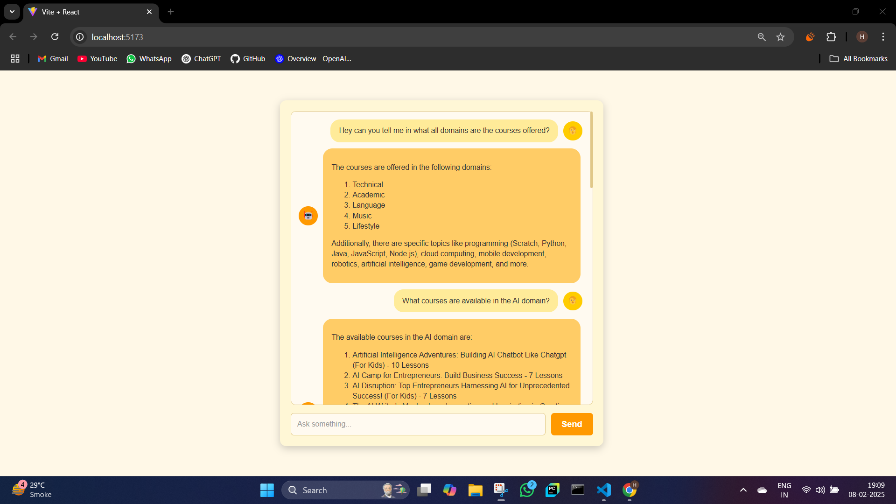
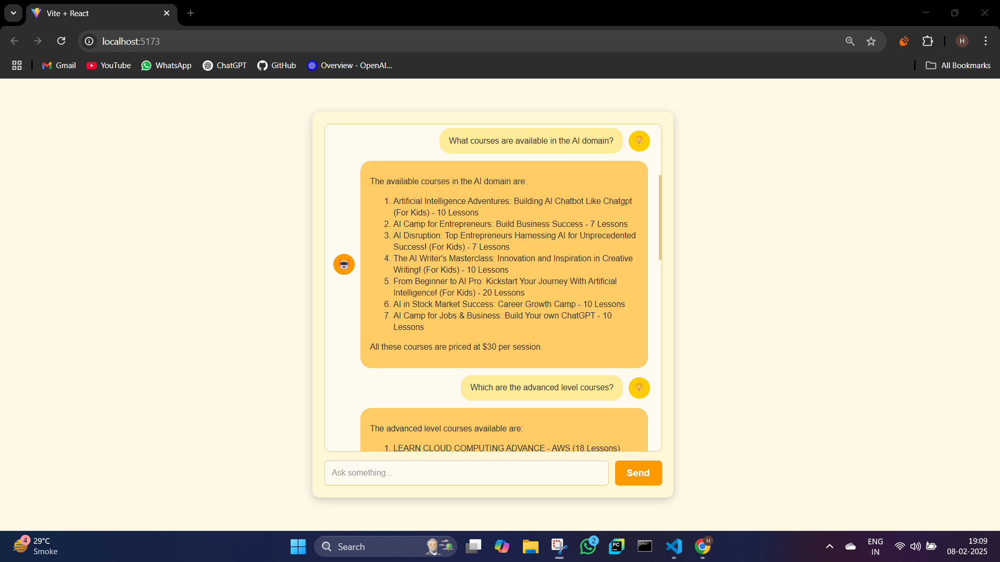
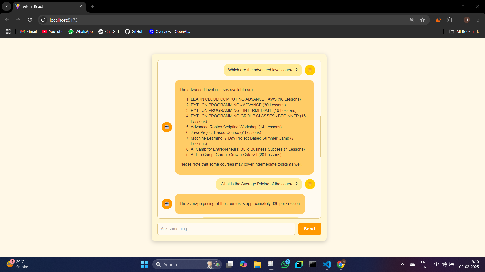
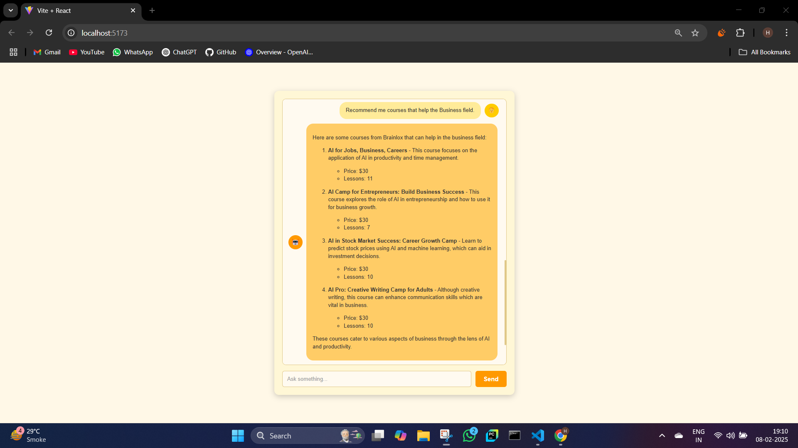

# 🤖 LangChain RAG Chatbot

A **Retrieval-Augmented Generation (RAG) chatbot** built using **LangChain, OpenAI, FAISS, and Flask**. This chatbot can scrape web data, store embeddings, and retrieve relevant information to generate intelligent responses.

## 🚀 Features
- 🌐 **Web Scraping**: Uses `WebBaseLoader` to collect and preprocess data.
- 🧠 **Vector Storage**: Stores embeddings using FAISS for efficient retrieval.
- 🔍 **Contextual Search**: Enhances responses with relevant context.
- 🗣️ **Flask REST API**: Serves responses via a backend API.
- ⚡ **Optimized Processing**: Avoids redundant embedding generations.

## 📷 Screenshots
### **Chat Interface**


### **Chat Interface**


### **Chat Interface**


### **Chat Interface**



## 🏗️ Tech Stack
- **Backend**: Python, Flask, LangChain
- **Embeddings**: OpenAI `text-embedding-3-large`
- **Vector Storage**: FAISS
- **Frontend**: React (for chatbot UI)

## 🔧 Setup & Installation
### 1️⃣ **Clone the Repository**
```sh
git clone https://github.com/HimanshuBhosale25/langchain-rag-chatbot.git
cd langchain-rag-chatbot
```

### 2️⃣ **Backend Setup**
```sh
cd backend
conda activate your_env_name
pip install -r requirements.txt
python app.py
```

### 3️⃣ **Frontend Setup**
```sh
cd frontend
npm install
npm run dev
```

